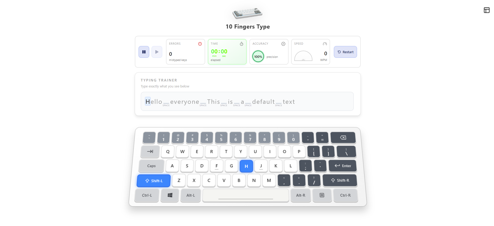
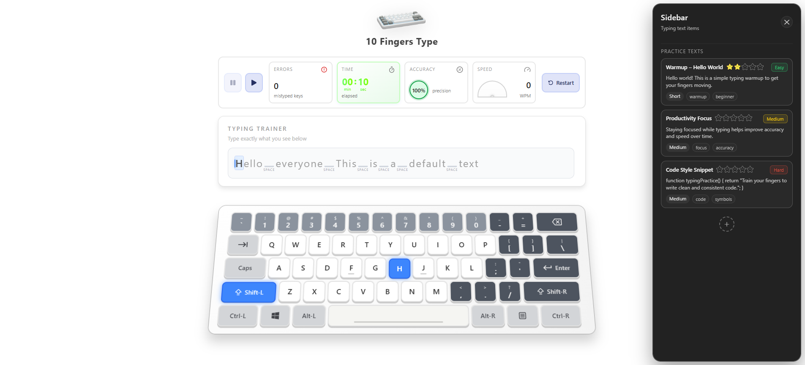
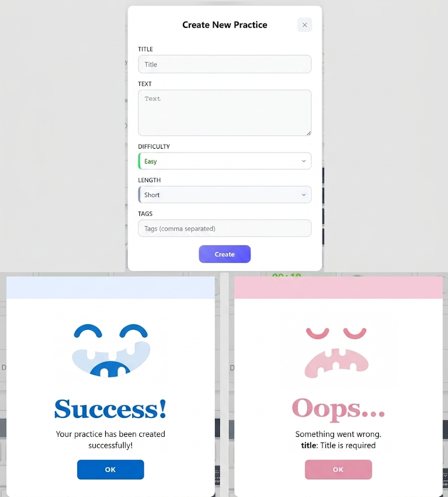

# 10 Fingers Type

A modern typing practice app built with React, TypeScript, Redux Toolkit, and Vite. It helps users train speed and accuracy with selectable practice texts, a visual keyboard, instant mistake feedback, and end-of-session results.

## Features

- Practice typing with built-in text presets
- Create custom practice texts with title, difficulty, length, and tags
- Visual keyboard that highlights the next expected key
- Wrong-key feedback while typing
- Live tracking for accuracy, speed, typed characters, and errors
- Session summary with time, WPM, accuracy, errors, and medal feedback
- Star-based best score tracking per preset
- Slide-out sidebar for choosing practice items
- Keyboard sound feedback for a more interactive experience

## Tech Stack

- React 19
- TypeScript
- Vite
- Redux Toolkit and React Redux
- React Router
- React Hook Form and Zod
- Framer Motion
- CSS Modules
- Lucide React and React Icons

## Getting Started

### Prerequisites

- Node.js
- npm

### Installation

```bash
npm install
```

### Run the Development Server

```bash
npm run dev
```

Open the local URL printed by Vite in your browser.

## Project Structure

```text
src/
  assets/       Static images used by the interface
  components/   Reusable UI and typing experience components
  features/     Redux slices for keyboard state and user progress
  hook/         Custom React hooks
  pages/        App pages
  store/        Redux store configuration
```

## Project Picture
<p align="center">
  
  <br>
  
  <br>
  
</p>

## How It Works

Choose a practice text from the sidebar or create your own. The app shows the target text and highlights the next key on the on-screen keyboard. As you type, it records correct and incorrect characters, updates accuracy and speed, and shows a result modal when the practice is complete.

## Notes

- Custom practice items and scores are stored in Redux state during the current session.
- The default route is `/`.
- The app is optimized for keyboard-driven practice.
